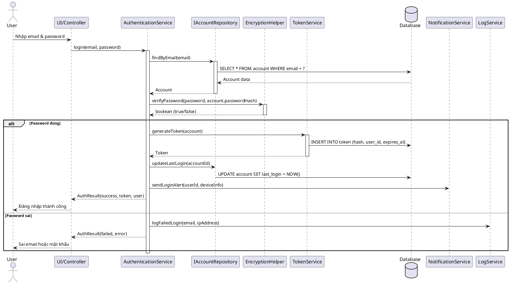
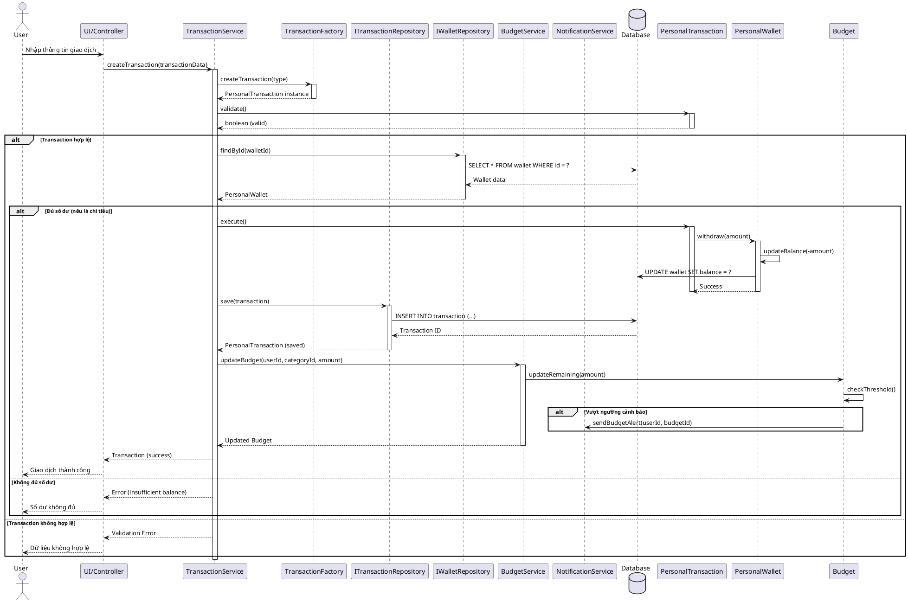
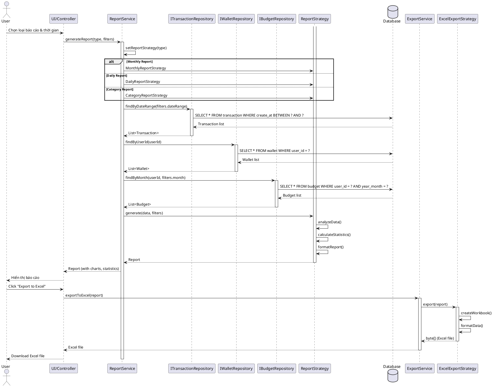
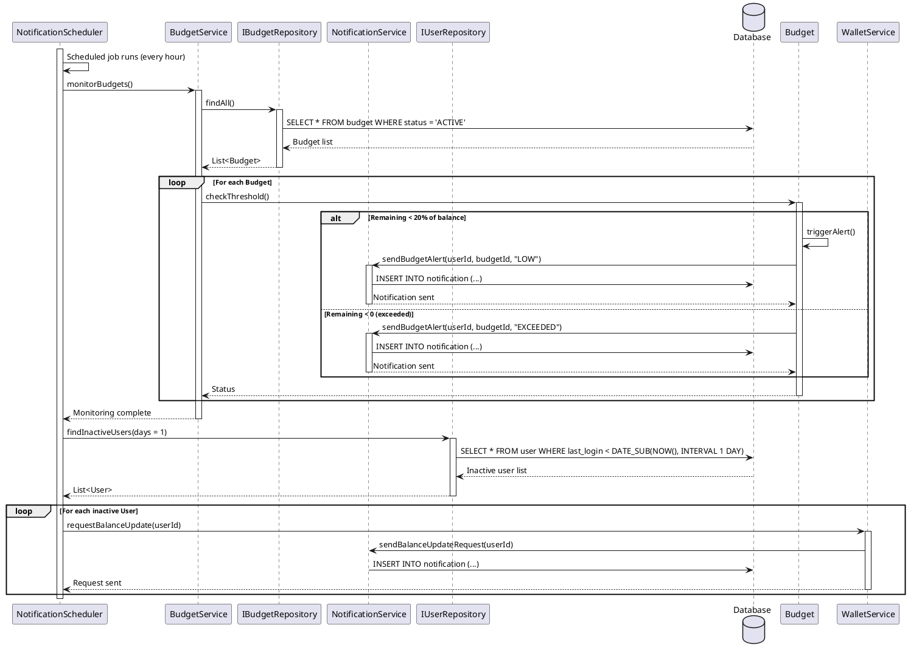
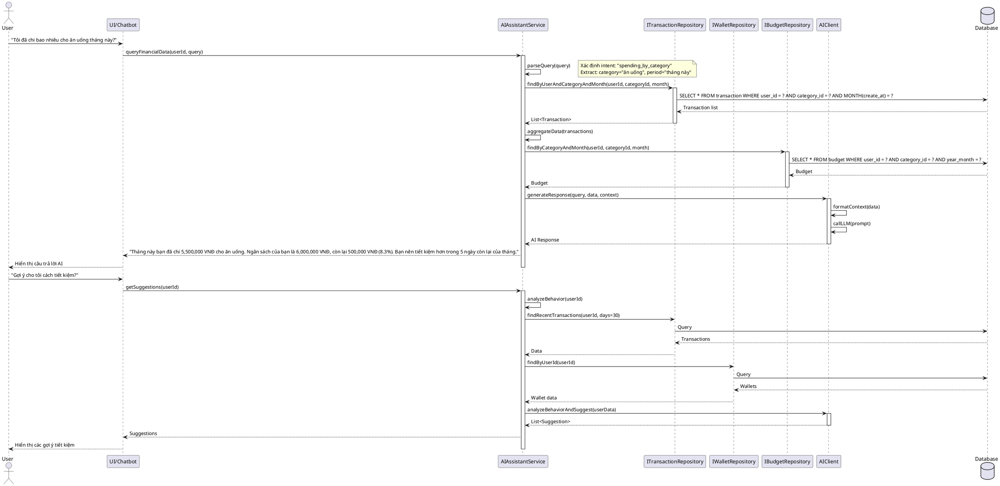
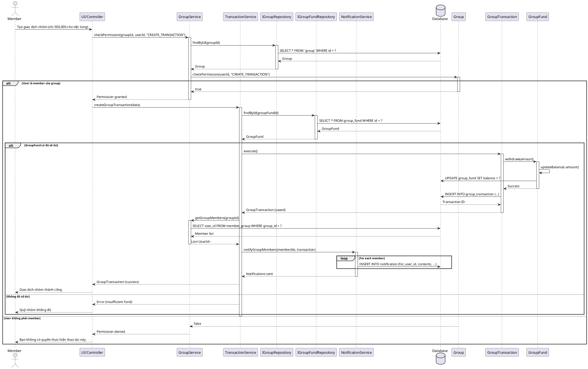
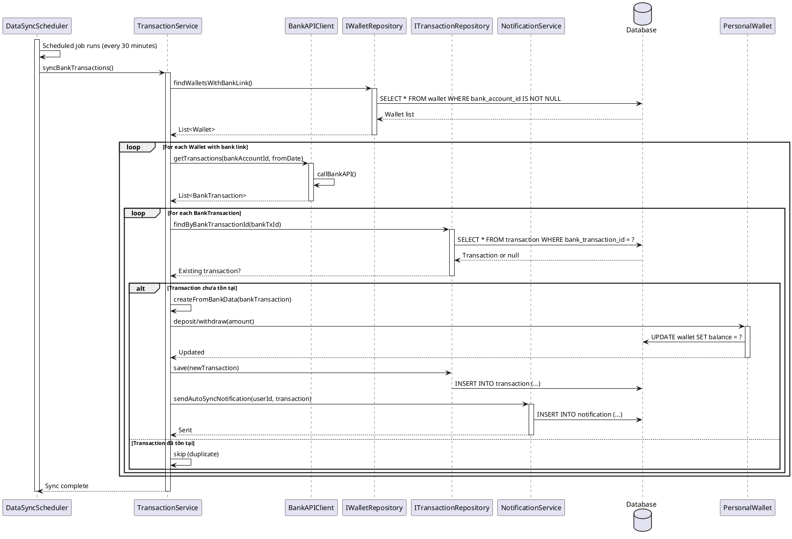

# SEQUENCE DIAGRAMS - USE CASES QUAN TRỌNG

## 1. USER AUTHENTICATION (Đăng nhập)

## 2. CREATE TRANSACTION (Tạo giao dịch)

## 3. GENERATE REPORT (Tạo báo cáo)

## 4. BUDGET MONITORING (Giám sát ngân sách - Background Job)

## 5. AI CHATBOT QUERY (Truy vấn AI)

## 6. GROUP TRANSACTION (Giao dịch nhóm)

## 7. BANK SYNC (Đồng bộ giao dịch ngân hàng - Background Job)

## LƯU Ý KHI VẼ SEQUENCE DIAGRAM

### 1. Các thành phần cơ bản:
- **Actor**: Người dùng, hệ thống bên ngoài
- **Participant**: Class, Service, Repository
- **Activate/Deactivate**: Lifecycle của object
- **Alt/Else**: Điều kiện rẽ nhánh
- **Loop**: Vòng lặp

### 2. Best practices:
- Bắt đầu từ Actor (User)
- Flow từ trái sang phải, trên xuống dưới
- Hiển thị rõ validation và error handling
- Đánh dấu async operations nếu có
- Nhóm các operations liên quan

### 3. Mức độ chi tiết:
- **High-level**: Chỉ main flow, bỏ qua details
- **Medium-level**: Include validation, main branches
- **Detailed**: Bao gồm cả error handling, logging, notifications

Các sequence diagrams trên đã cover các use case chính của hệ thống. Bạn có thể dùng PlantUML để render ra hình ảnh!
